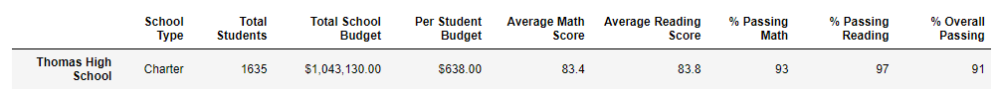
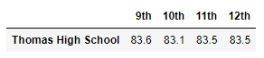

# Student Grade Update
## Overview of Analysis

### A set of test scores needed to be changed due to an incedent of academic dishonesty in the 9th grade students at Thomas High School. The purpose of this analysis was to adjust those grades and find out how that adjustment effected the high level numbers and averages. 

## School/Grade Analysis Results

### In this analysis we looked at the effects the score change had by district and by school. We also compare how Thomas High School faired against other schools both before and after the change. Finally, looking accross all schools, we will analyze how this change effected math and reading scores by grade, as well as the scores by school spending, scores by school size, and scores by school type. 
  -  At a district level we can see that this score adjustment had very little effect. Scores Before Change ...  Scores After Change ...  As you can see, the average reading score stayed the same, and the average math declined but only by .1 point. The percentage of students passing math and reading went down by .2 and .3 percent respectively, and the overall passing percentage decreased by just .1 percent.
  -  At the school level, as Thomas High Scool was the only school for which we changed grades, they are the only school whose numbers were effected by the change. Again, like at the ditrict level there is almost no change between the previous and new scores. The only place there was a change at the school level was the average reading scores, and there was actually an improvement when the 9th grade scores were removed. Scores Before Change ...  Scores After Change ... 
  -  When looking at how this change effects the way Thomas High School compares to the other schools in the dataset we find the same result as we did in previous comparisons. No change. Prior to the score change Thomas High ranked 2nd out of all the schools and it continued to hold that position after the change. It should be noted however that the margin Thomas High holds that position by is smaller then it was prior to the change. Before the change it was .35 percent above Griffen High School and after the change it is only .04 percent above them. Scores Before Change ...  Scores After Change ... 
  -  something about the data below
     *  Math Scores Before/After Change ...   Reading Scores Before/After Change ...  
     * 
     * 
     *

## Summary

  As can seen above, 

