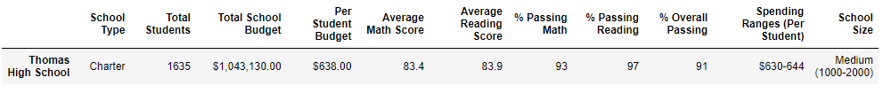

# Student Grade Update
## Overview of Analysis

### A set of test scores needed to be changed due to an incedent of academic dishonesty in the 9th grade students at Thomas High School. The purpose of this analysis was to adjust those grades and find out how that adjustment effected the high level numbers and averages. 

## School/Grade Analysis Results

### In this analysis we looked at the effects the score change had by district and by school. We also compare how Thomas High School faired against other schools both before and after the change. Finally, looking accross all schools, we will analyze how this change effected math and reading scores by grade, as well as the scores by school spending, scores by school size, and scores by school type. 
  -  At a district level we can see that this score adjustment had very little effect. Scores Before Change ...  Scores After Change ...  As you can see, the average reading score stayed the same, and the average math declined but only by .1 point. The percentage of students passing math and reading went down by .2 and .1 percent respectively, and the overall passing percentage decreased by .3 percent.
  -  At the school level, as Thomas High Scool was the only school for which we changed grades, they are the only school whose numbers were effected by the change. Again, like at the district level there is almost no change between the previous and new scores. The only place there was a change at the school level was the average reading scores, and there was actually an improvement when the 9th grade scores were removed. Scores Before Change ...  Scores After Change ... 
  -  When looking at how this change effects the way Thomas High School compares to the other schools in the dataset we find the same result as we did in previous comparisons. No change. Prior to the score change Thomas High ranked 2nd out of all the schools and it continued to hold that position after the change. It should be noted however that the margin Thomas High holds that position by is smaller then it was prior to the change. Before the change it was .35 percent above Griffen High School and after the change it is only .04 percent above them. Scores Before Change ...  Scores After Change ... 
  -  Here are some other ways we looked at to see how replacing the ninth grade scores for Thomas High School effected things
     *  Looking at the scores by grade level we see what we would expect, that the only thing different between the scores prior to the change and after the change in that the 9th grade scores are gone (represented by nan).   ...Math Scores Before/After Change       ...Reading Scores Before/After Change 
     *  We looked at the data grouped in bins of different spending levels for effects of the score change, but like other times there was zero change from before the change to after. Scores Before and After Change...
     *  We also looked at the data grouped by school size but again, the data from before the change is the same as the data after. Scores Before and After Change...
     *  Finally we look at everything grouped by school type, district or charter, to see if the averages were effected. Busame as the other comparison these numbers are the same before and after. Scores Before and After Change...

## Summary

  As can be seen above, there was very little actual impact on the scores from making this change. At a district level we saw small decreases in both math and reading averages. We also saw decreases in each of the passing percentages after the change, with the .2 decrease in reading passing percentage being the highest. Thirdly, the odd change that occured after removing the 9th grade scores for Thomas High was that their average reading scores went up as opposed to going down as one migh think they would. Finally though the rankings of schools did not actually change, with a small drop in overall passing percentage, Thomas High is mush closer to third place after the score changes then it was before. So in summary, there was very minimal effect from removing the 9th grade score for Thomas High School. 

